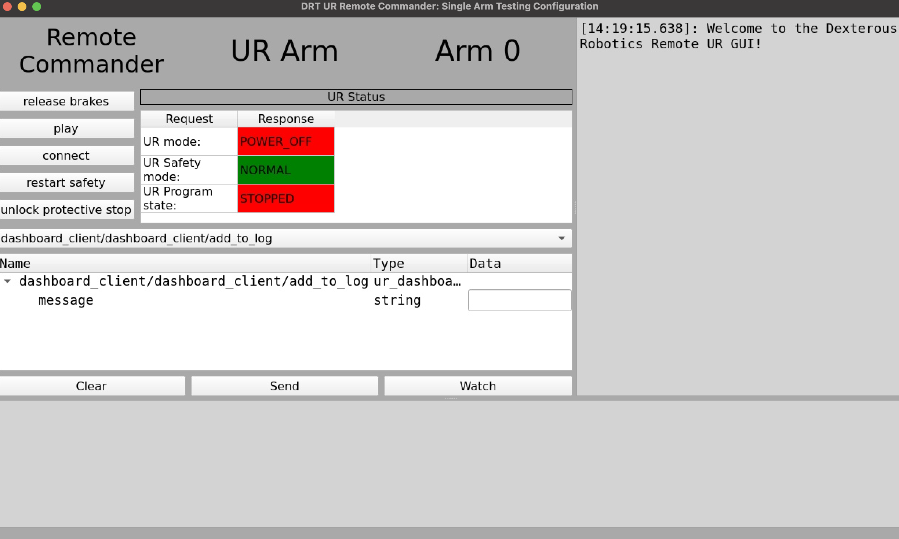

# DRT Universal Robots GUI

`drt_ur_gui` is a ROS 2 based user interface written in python that enables remote operation of Universal Robotics collaborative robotic arms.
The key delivered features:

- Enables command of UR Arms with out Polyscope touchscreen pendant interaction
- Intended to be used with UR Arms configured for Remote Control
- Useful in operations where Polyscope interaction is difficult or unsafe



## Installation

This package can be installed in any normal `colcon` workspace:

1) Clone `drt_ur_gui` into your workspace `src/` directory
2) Use rosdep to install `drt_ur_gui`'s dependencies
3) Build your workspace

```bash
cd src/
git clone git@js-er-code.jsc.nasa.gov:imetro/drt_ur_gui.git
rosdep install -iy --from-paths . --rosdistro=humble
cd ..
colcon build
```

## Usage

On its own `drt_ur_gui` is configured to command up to two URs at once using launch files.
However, more configuration files can be used to command any number of active UR arms.

### One arm use

```bash
# To connect to a hardware UR dashboard client
ros2 launch drt_ur_gui one_arm.launch.py

# To launch a simulated client for development and testing
ros2 launch drt_ur_gui one_arm.launch.py mock_dashboard:=true
```

- `one_arm.launch.py` is used to run a singular UR arm using the settings in `config/one_arm.yaml`:
    - `dashboard_client_name`: name of the UR `dashboard_client` node, must match or UR communication will fail
    - `program`: sets the default program to be loaded to the UR when `/dashboard_client/load_program` is selected
    - `window.name`: sets the name that appears in the bar at the top of the UI window
    - `window.stylesheet`: Qt format stylesheet, enables users to customize the look and feel of the UI
    - `logo_file_name`: the filepath to the logo to be displayed in the UI window

### Dual arm use

- `two_arm.launch.py` is used to run two URs at once, typically in a "humanoid" left-right configuration
    - `ros2 launch drt_ur_gui two_arm.launch.py`
    - Configured by `config/two_arm_left.yaml` and `config/two_arm_right.yaml`
        - Parameters exposed in the two arm configuration files are the same as the one arm configuration parameters explained above

### *N* arm use and use with other robots

- `drt_ur_gui` can command any number of UR arms in (probably) any robot setup
    - Every `drt_ur_gui` backend node communicates with an arm's respective `dashboard_client` node
    - The UI can be run from the command line without configuration files as long as the correct `dashboard_client` node name is provided as a parameter
        - `ros2 run drt_ur_gui run_gui.py --ros-args -p dashboard_client_name:=<your_dashboard_client_name>`
    - Alternatively, and similar to the launch files, a full configuration/parameters file can be used if you provide the path
        - `ros2 run drt_ur_gui run_gui.py --ros-args --params-file <path_to_your_params_file>`
    - `drt_ur_gui` can also be integrated into your robot's existing launch files
        - Use the provided launch files as and example

## Citation

This project falls under the purview of the iMETRO project. 
If you use this in your own work, please cite the following paper:

```bibtex
@INPROCEEDINGS{imetro-facility-2025,
  author={Dunkelberger, Nathan and Sheetz, Emily and Rainen, Connor and Graf, Jodi and Hart, Nikki and Zemler, Emma and Azimi, Shaun},
  booktitle={2025 22nd International Conference on Ubiquitous Robots (UR)},
  title={Design of the iMETRO Facility: A Platform for Intravehicular Space Robotics Research},
  year={2025},
  volume={},
  number={},
  pages={390-397},
  keywords={NASA;Moon;Seals;Maintenance engineering;Maintenance;Robots;Standards;Open source software;Testing;Logistics},
  doi={10.1109/UR65550.2025.11077983}}
```
